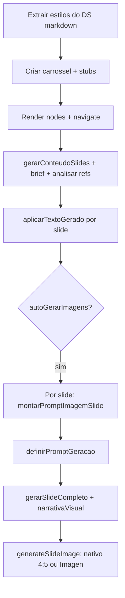

# Continuidade: fluxo de carrossel (conteúdo → imagem) e prompts por slide

Documento para retomar o trabalho no Cursor/Claude. Não substitui [`CLAUDE.md`](../CLAUDE.md). Para um guia pedagógico (alunos), ver também [**Prompt para correção**](Prompt-para-correcao.md).

## Objetivo alcançado

Separar **geração de texto** (matéria, tom, links como contexto) da **geração visual**, evitar colar o markdown inteiro do design system no prompt de imagem, e dar **um prompt criativo por slide** (Gemini texto) antes da arte, com sequência narrativa (capa → meio → CTA).

**Geração de imagem:** primeiro tenta modelos **nativos** (`generateContent` com `responseModalities` IMAGE, aspect ratio incl. `4:5`), na ordem configurável (`VITE_GEMINI_IMAGE_NATIVE_MODELS`, padrão `gemini-3-pro-image-preview`, `gemini-2.5-flash-image`). Se não houver `inlineData` de imagem ou houver erro, faz **fallback** para **Imagen** (`imagen-4.0-*` via `:predict`; `4:5` mapeia para `3:4`). Texto de slides: **Pro** por defeito com **retries + backoff** e fallback para **Flash** em 503/429; tarefas baratas (extrair tokens do DS, resumo visual) usam **Flash**.

## Problemas que motivaram as mudanças

1. **Texto preso em “Gerando conteúdo…”** — `aplicarTextoGerado` usava `slides.find` no estado do hook; no primeiro render após `navigate` o array ainda estava vazio → `null` silencioso e nada persistia no Supabase.
2. **Imagens genéricas / “guia de design system”** — prompt do Imagen misturava referências visuais (moodboards) com negativas confusas; copy errada alimentava o modelo.
3. **Falta de prompt explícito por slide** — o utilizador queria ver/editar a direção criativa antes de gerar cada arte.

## Arquivos principais alterados

| Área | Ficheiro | O que faz |
|------|----------|-----------|
| Hook slides | [`src/hooks/useCarouselSlides.ts`](../src/hooks/useCarouselSlides.ts) | `aplicarTextoGerado`: `select` por `id` antes do `update` (sem depender de `slides` em memória). `definirPromptGeracao(slideId, prompt)` grava `image_generation_prompt`. |
| Gemini / IA | [`src/lib/gemini.ts`](../src/lib/gemini.ts) | Modelos: `VITE_GEMINI_TEXT_MODEL_QUALITY` (padrão `gemini-2.5-pro`), `VITE_GEMINI_TEXT_MODEL_FAST` (padrão `gemini-2.5-flash`); retries: `VITE_GEMINI_TEXT_RETRIES`, `VITE_GEMINI_TEXT_RETRY_BASE_MS`; imagem: `VITE_GEMINI_IMAGE_RETRIES`. `gerarConteudoSlides` (matéria + regras anti-alucinação). `extrairSlideStylesDoDesignSystem`, `compactarDesignSystemParaBriefVisual`. `gerarRoteirosNodes` orquestra conteúdo + estilos. **`montarPromptImagemSlide`**: com `referenceImageUrls` usa visão multimodal. **`gerarSlideCompleto`**: `narrativaVisual` + consistência de template. **`generateSlideImage`**: nativo Gemini → Imagen. **`analisarReferenciasVisuais`**: saída estruturada (TIPOGRAFIA, ZONAS_DE_LAYOUT, …). |
| Workspace | [`src/pages/WorkspacePage.tsx`](../src/pages/WorkspacePage.tsx) | `designSystemRefImageUrls` via `useMemo` (carrossel + DS). Passa `referenceImageUrls` a `gerarImagensEmBackground` e ao modal. |
| Modal imagem | [`src/components/modals/GenerateImageModal.tsx`](../src/components/modals/GenerateImageModal.tsx) | `fullSlide.referenceImageUrls` repassado a `montarPromptImagemSlide`. |
| Constantes | [`src/data/mock.ts`](../src/data/mock.ts) | `PLACEHOLDER_TEXTO_SLIDE_GERANDO`. |
| Preview slide | [`src/components/nodes/SlideNode.tsx`](../src/components/nodes/SlideNode.tsx) | Estilo distinto para texto placeholder. |

## Commits recentes (referência)

- `feat: fluxo conteúdo→visual, brief DS no Imagen e UX progressiva no workspace`
- `feat: prompt por slide (Gemini), fix aplicarTextoGerado e modal de imagem`
- `feat: Gemini Pro para texto, imagem nativa 4:5 e prompts mais consistentes`
- `fix: retry e fallback flash quando Gemini texto retorna 503/429`
- `fix: retries na geração de imagem (nativo + Imagen) e doc de continuidade`

## Últimos passos — modelos, consistência, copy e resiliência (para Claude)

Resumo do que foi feito em [`src/lib/gemini.ts`](../src/lib/gemini.ts) e ajustes correlatos na doc, para retomar contexto sem reler o diff inteiro.

### Motivação

- **Consistência visual:** cada slide saía com layout/cores/hierarquia muito diferentes entre si.
- **Qualidade do texto:** alucinações, números inventados, placeholders tipo “CTA 5”.
- **Disponibilidade:** `gemini-2.5-pro` a devolver **503** (“high demand”) e a pipeline a falhar antes de gerar imagens.

### Modelos de texto (dois níveis)

- **`postGeminiParts`** passou a escolher o modelo por **tier** ou **`model` explícito**:
  - **`quality`** (padrão em copy “cara”): `VITE_GEMINI_TEXT_MODEL_QUALITY` ou `gemini-2.5-pro`.
  - **`fast`** (tarefas leves): `VITE_GEMINI_TEXT_MODEL_FAST` ou `gemini-2.5-flash`.
- Usam **`quality`**: `gerarConteudoSlides`, `gerarRoteiro`, `gerarIdeias`, `montarPromptImagemSlide` (texto e multimodal), `analisarReferenciasVisuais`, `regenerarCampoSlide`.
- Usam **`fast`**: `extrairSlideStylesDoDesignSystem`, `compactarDesignSystemParaBriefVisual`.
- **Resiliência texto:** em **429 / 500 / 502 / 503** (e falhas de rede no `fetch`), **repetição com backoff exponencial** (`VITE_GEMINI_TEXT_RETRIES`, máx. 8; `VITE_GEMINI_TEXT_RETRY_BASE_MS`). Se o modelo de qualidade esgotar tentativas com erro transitório, **fallback automático** para o modelo **fast** (cadeia `pro → flash` quando não há `model` explícito).

### Modelos de imagem (nativo + Imagen)

- **`generateSlideImage`** tenta primeiro **Gemini nativo** (`generateContent` + `generationConfig.responseModalities: ["TEXT","IMAGE"]` + `imageConfig.aspectRatio`, incl. **`4:5`**).
- Ordem de modelos: `VITE_GEMINI_IMAGE_NATIVE_MODELS` (CSV) ou padrão `gemini-3-pro-image-preview`, `gemini-2.5-flash-image` (Nano Banana Pro / imagem de qualidade na documentação Google).
- Extração da imagem: **`inlineData`** em base64 (`extractGeminiNativeInlineImage`).
- Se nenhum modelo nativo devolver imagem: **Imagen** `imagen-4.0-generate-001` → `imagen-4.0-fast-generate-001` via **`:predict`**; **`4:5`** mapeia para **`3:4`** no Imagen (`mapAspectForImagen`).
- **Resiliência imagem:** retries com o mesmo critério de status transitório em **`tryGeminiNativeImage`** e em **`predictImagenModel`** (`VITE_GEMINI_IMAGE_RETRIES`, máx. 6; base de espera partilhada com `VITE_GEMINI_TEXT_RETRY_BASE_MS`).

### Copy e anti-alucinação

- Em **`gerarConteudoSlides`**: instruções para **não inventar** preços, percentagens, datas ou números que não existam nas fontes; proibição de rótulos tipo “CTA 3”, “Slide 5”, placeholders.
- **`sanitizarCamposNodeSlide`**: pós-processamento leve nos campos de texto após `normalizeNodeSlides` (remove padrões residuais tipo `CTA 5`).

### Consistência visual nos prompts

- **`gerarSlideCompleto`**: bloco **TEMPLATE ÚNICO** (mesmo grid/margens/hierarquia relativa em todos os slides; corpo partilha estrutura entre si; CTA só com tokens de CTA, sem estilo “novo” genérico). Descrições de **LAYOUT** por tipo (capa / corpo / CTA) alinhadas a **repetir o mesmo template** das referências, não a inventar um estilo por slide.
- **`montarPromptImagemSlide`**: reforços para que o slide pareça o **próximo do mesmo template** (ramo multimodal com refs de pixels e ramo só texto).

### Erros do browser não relacionados

- **`Could not establish connection. Receiving end does not exist`**: em geral **extensão Chrome** (mensagens para um background inexistente), não bug da app.

### Variáveis de ambiente (Gemini)

| Variável | Função |
|----------|--------|
| `VITE_GEMINI_API_KEY` | Chave API (obrigatória). |
| `VITE_GEMINI_TEXT_MODEL_QUALITY` | Modelo texto “forte” (default `gemini-2.5-pro`). |
| `VITE_GEMINI_TEXT_MODEL_FAST` | Modelo texto rápido (default `gemini-2.5-flash`). |
| `VITE_GEMINI_TEXT_RETRIES` | Tentativas por modelo no texto (default 4, máx. 8). |
| `VITE_GEMINI_TEXT_RETRY_BASE_MS` | Base do backoff texto e imagem (default 1200). |
| `VITE_GEMINI_IMAGE_NATIVE_MODELS` | CSV de modelos `generateContent` com imagem. |
| `VITE_GEMINI_IMAGE_RETRIES` | Tentativas por chamada nativa/Imagen (default 3, máx. 6). |

## Fluxo atual (resumo)

## O que ficou de fora / follow-up (plano original)

- **Fase D — URLs**: `gerarConteudoSlides` já usa `callGemini(..., useSearch)` quando há URLs; não há scraping garantido do HTML. Melhoria possível: Edge Function ou backend para extrair texto da página e injetar no prompt.
- **Race opcional**: se aparecer flicker entre `inserirSlides` e `carregar()`, considerar debounce ou ignorar `carregar` durante pipeline ativo.
- **Custo**: prompts por slide = N chamadas Gemini texto extra no auto-gerar imagens; cache por `design_system_id` / hash de copy seria otimização futura.

## Como validar manualmente

1. Novo workspace: gerar carrossel com URLs + DS + refs visuais + auto imagens — texto deve substituir placeholder; imagens devem refletir copy + narrativa.
2. Abrir “Gerar IA” num slide: prompt pré-preenchido, editar, gerar, confirmar.
3. Reabrir carrossel existente: `syncDsContext` repovoa `visualBriefRef` / `visualRefDescRef` a partir do DS ligado.

## Contratos úteis

- **`CarouselImagePromptContext`**: `titulo`, `descricao`, `referencesUrls`, `referencesText`, `tomNome`, `tomDescricao`.
- **`montarPromptImagemSlide`**: `todosSlides` + `slideAtual` + `totalSlides` + `styles` + `visualBrief?` + `referenceDescription` + opcional **`referenceImageUrls`** (ativa ramo multimodal).

---

*Última atualização: 2026-05-14 — secção “Últimos passos” (modelos Gemini, consistência, retries e envs).*
