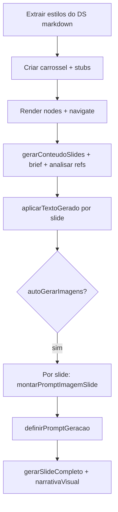

# Continuidade: fluxo de carrossel (conteúdo → imagem) e prompts por slide

Documento para retomar o trabalho no Cursor/Claude. Não substitui [`CLAUDE.md`](../CLAUDE.md).

## Objetivo alcançado

Separar **geração de texto** (matéria, tom, links como contexto) da **geração visual** (Imagen), evitar colar o markdown inteiro do design system no prompt de imagem, e dar **um prompt criativo por slide** (Gemini texto) antes do Imagen, com sequência narrativa (capa → meio → CTA).

## Problemas que motivaram as mudanças

1. **Texto preso em “Gerando conteúdo…”** — `aplicarTextoGerado` usava `slides.find` no estado do hook; no primeiro render após `navigate` o array ainda estava vazio → `null` silencioso e nada persistia no Supabase.
2. **Imagens genéricas / “guia de design system”** — prompt do Imagen misturava referências visuais (moodboards) com negativas confusas; copy errada alimentava o modelo.
3. **Falta de prompt explícito por slide** — o utilizador queria ver/editar a direção criativa antes de gerar cada arte.

## Arquivos principais alterados

| Área | Ficheiro | O que faz |
|------|----------|-----------|
| Hook slides | [`src/hooks/useCarouselSlides.ts`](../src/hooks/useCarouselSlides.ts) | `aplicarTextoGerado`: `select` por `id` antes do `update` (sem depender de `slides` em memória). `definirPromptGeracao(slideId, prompt)` grava `image_generation_prompt`. |
| Gemini / IA | [`src/lib/gemini.ts`](../src/lib/gemini.ts) | `gerarConteudoSlides` (só matéria, sem DS no prompt). `extrairSlideStylesDoDesignSystem`, `compactarDesignSystemParaBriefVisual`. `gerarRoteirosNodes` orquestra conteúdo + estilos. **`montarPromptImagemSlide`**: com `referenceImageUrls` usa **visão multimodal** (mesmas imagens do DS) para instruções de layout fiel; senão texto + `referenceDescription`. **`gerarSlideCompleto`**: `narrativaVisual` + bloco **FIDELIDADE_AO_DESIGN_SYSTEM** quando há análise de refs. **`analisarReferenciasVisuais`**: saída estruturada (TIPOGRAFIA, ZONAS_DE_LAYOUT, HIERARQUIA_VISUAL, PALETA, …). |
| Workspace | [`src/pages/WorkspacePage.tsx`](../src/pages/WorkspacePage.tsx) | `designSystemRefImageUrls` via `useMemo` (carrossel + DS). Passa `referenceImageUrls` a `gerarImagensEmBackground` e ao modal. |
| Modal imagem | [`src/components/modals/GenerateImageModal.tsx`](../src/components/modals/GenerateImageModal.tsx) | `fullSlide.referenceImageUrls` repassado a `montarPromptImagemSlide`. |
| Constantes | [`src/data/mock.ts`](../src/data/mock.ts) | `PLACEHOLDER_TEXTO_SLIDE_GERANDO`. |
| Preview slide | [`src/components/nodes/SlideNode.tsx`](../src/components/nodes/SlideNode.tsx) | Estilo distinto para texto placeholder. |

## Commits recentes (referência)

- `feat: fluxo conteúdo→visual, brief DS no Imagen e UX progressiva no workspace`
- `feat: prompt por slide (Gemini), fix aplicarTextoGerado e modal de imagem`

## Fluxo atual (resumo)

## O que ficou de fora / follow-up (plano original)

- **Fase D — URLs**: `gerarConteudoSlides` já usa `callGemini(..., useSearch)` quando há URLs; não há scraping garantido do HTML. Melhoria possível: Edge Function ou backend para extrair texto da página e injetar no prompt.
- **Race opcional**: se aparecer flicker entre `inserirSlides` e `carregar()`, considerar debounce ou ignorar `carregar` durante pipeline ativo.
- **Custo**: prompts por slide = N chamadas Gemini texto extra no auto-gerar imagens; cache por `design_system_id` / hash de copy seria otimização futura.

## Como validar manualmente

1. Novo workspace: gerar carrossel com URLs + DS + refs visuais + auto imagens — texto deve substituir placeholder; imagens devem refletir copy + narrativa.
2. Abrir “Gerar IA” num slide: prompt pré-preenchido, editar, gerar, confirmar.
3. Reabrir carrossel existente: `syncDsContext` repovoa `visualBriefRef` / `visualRefDescRef` a partir do DS ligado.

## Contratos úteis

- **`CarouselImagePromptContext`**: `titulo`, `descricao`, `referencesUrls`, `referencesText`, `tomNome`, `tomDescricao`.
- **`montarPromptImagemSlide`**: `todosSlides` + `slideAtual` + `totalSlides` + `styles` + `visualBrief?` + `referenceDescription` + opcional **`referenceImageUrls`** (ativa ramo multimodal).

---

*Última atualização: documento criado para continuidade pós-implementação do plano “conteúdo confiável + prompt por slide”.*
